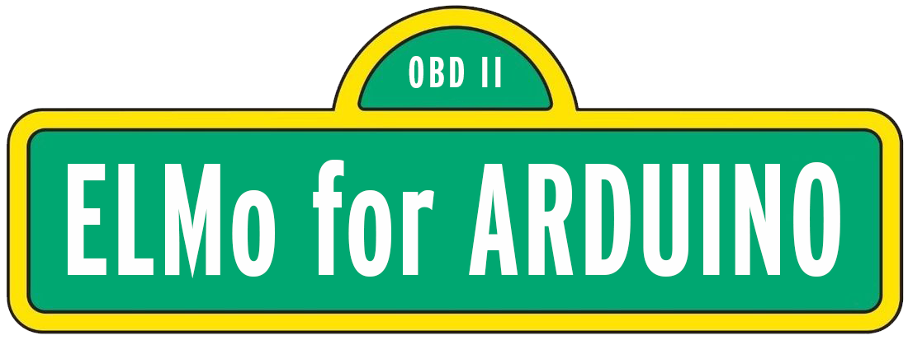

# Welcome to the ELMo Library

## What's ELMo?
ELMo is a library that simplifies communication between ELM327 devices and ESP32 microprocessors. The library also allows this communication to happen synchronously. This allows for code to be written with linear logic to avoid finding yourself in [*callback hell*](http://callbackhell.com/). This library is supposed a barebones, yet easy-to-use middle man between your logic and the ELM327 device.

## How do I get it?
**Method 1: Arduino Library manager**
1. Open the library manager in your IDE of choice (Arduino IDE or PlatformIO)
2. Search for `ELMo`
3. Click install
4. `include` ELMo in your project
5. Profit!

**Method 2: GitHub Releases**
1. Go to the Releases page
2. Look at the latest version, denoted by the  tag
3. Download the source as a `.zip` file
4. Extract the `.zip` file to your `libraries` directory

## How do I use it?
Advanced instructions and function definitions can be found in the [Wiki](https://github.com/rudydelorenzo/ELMo/wiki). To get started, however, all you need to do is:
1. Create an ELMo instance with `ELMo ELM;`
2. Customize any of the settings if needed, or give the defaults a shot
3. Initialize the connection to the device with `ELM.initialize();`
    * You should probably do this in `setup();` 
5. Send messages to the device using `ELM.send("message");`
    * Wanna know what messages to send? Read on!

## On the subject of communications
The way that you communicate with an ELM device (and the way it communicates back) is by sending messages back and forth.

There are two kinds of messages:
* "AT" messages, and
*  Mode + PID messages

### AT Messages
__Most users will never have to issue an AT command.__

These messages are prepended by the letters "AT" (go figure) and are used to speak to the ELM controller chip. These messages are read by the ELM and NOT forwarded to the car.

For example, the message `AT Z` will tell the ELM327 device to reset itself.

"_But wait!_", you say. "_How am I supposed to know that `AT Z` means "reset"?_"

Great question! __Everything you need to know about ELM327 commands is in the [ELM327 datasheet](https://www.elmelectronics.com/wp-content/uploads/2020/05/ELM327DSL.pdf)!__ AT Commands and their descriptions begin on page 10.

This document might seem overwhelming at first, but it contains lots of great information that'll let you unlock all the capabilities of your ELM327 reader.
I recommend reading it, it's a thrilling tale. However, you do NOT have to read the document from cover to cover in order to use ELMo.

### Mode + PID Messages
These are messages that let you talk with your car. They're typically composed of two parts, a mode identifier and some Parameter IDs, or PIDs. Let's look at an example:

__`01 05`__

This command gives you the current Engine Coolant Temperature (ECT).

* Mode 01: This mode lets you check current car data.
* PID 05: This PID asks the car for the ECT. Had you sent a PID of __01__, the car would've given you stored DTCs (codes).

"_But wait!_", I hear you say. "_How am I supposed to know what 01 or 05 mean? How do I reset codes?_"

I'm glad you asked! __Everything you need to know about ELM327 commands is in the [ELM327 datasheet](https://www.elmelectronics.com/wp-content/uploads/2020/05/ELM327DSL.pdf)!__ Modes and PID descriptions begin on page 33.

This document might seem overwhelming at first, but it contains lots of great information that'll let you unlock all the capabilities of your ELM327 reader.
I recommend reading it, it's a thrilling tale. You can use the Find tool of your PDF viewer to search for any particular actions you're interested in.

Here are some of the highlights:
* __Talking to the Vehicle (MUST READ!)__ [(page 33 and 34)](https://www.elmelectronics.com/wp-content/uploads/2020/05/ELM327DSL.pdf#page=33).
    * __NOTE__: The `ELMo.initialize()` function sends a `01 00` command so you don't have to.
    * This section contains mode definitions.
    * These pages contain instructions on how to send commands. I recommend reading this as well.
    * Details on how responses are formatted are also present here.
* __Interpreting Trouble Codes__ [page 36](https://www.elmelectronics.com/wp-content/uploads/2020/05/ELM327DSL.pdf#page=36).
* __Resetting Trouble Codes__ [page 37](https://www.elmelectronics.com/wp-content/uploads/2020/05/ELM327DSL.pdf#page=37).
* __Multiline Responses__ [page 44](https://www.elmelectronics.com/wp-content/uploads/2020/05/ELM327DSL.pdf#page=44).
* __Power Control__ [page 67](https://www.elmelectronics.com/wp-content/uploads/2020/05/ELM327DSL.pdf#page=67).

## License
This project is licensed under the MIT License.
